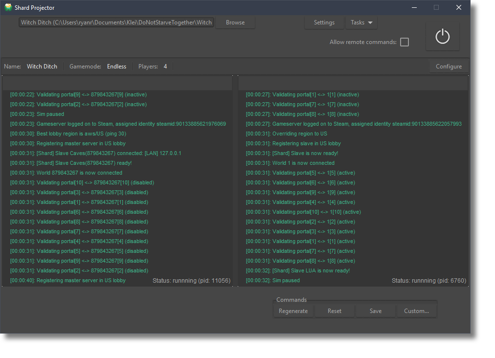

  

 <b>Shard Projector</b>

 Desktop dedicated servers for Don't Starve Together. 

 

# Notes

06/28/20

Shard Projector may require technical knowledge to play around with at the moment. [Read more..](notes/06-28-20)

# Table of Contents

- [Table of Contents](#table-of-contents)
- [Introduction](#introduction)
- [Features](#features)
    - [Modern Interface](#modern-interface)
    - [Cross-platform](#cross-platform)
- [Getting Started](#getting-started)
  - [Usage](#usage)
    - [(Alpha) Windows](#alpha-windows)
    - [(Unstable) Linux & MACOSX](#unstable-linux--macosx)
- [What's working right now?](#whats-working-right-now)
- [What's being worked on?](#whats-being-worked-on)
    - [For developers](#for-developers)
    - [For users](#for-users)
- [Notice](#notice)
  
# Introduction

Shard Projector is a user-friendly, 64bit, multi-threaded desktop app for running Don't Starve Together servers on Windows & Linux. 

Its being developed to bridge the gap for non-technical players who want to host worlds of their own, and provide an option other than a monthly server-subscription (it will always be free!). Use it to run worlds of all kinds easily for you & your friends on dedicated servers that are simple to setup, manage, moderate and access- even when you're not online!

Whether you're running a LAN server at the house, hosting a 24-player online for your region, or debugging mods, Shard Projector has features you'll appreciate.

# Features

### Modern Interface

Simple yet powerful controls for running, monitoring, and configuring your server.

### Cross-platform

Developed with Tkinter, a framework for creating user-interfaces that works wherever Python can run.

Shard Projector currently supports Windows. Linux and MACOSX users should check back often. 

Users with Python knowledge could very well have it running on those platforms in an afternoon. I'd love to hear about any such endevours and even assist with your specific patch, doesn't need to be release-ready code in any sense. 

*Note: get in touch with me at raposo.ryan@gmail.com if you'd like to assist with MACOSX optimization/testing. Early-access to new versions a guarantee!*

# Getting Started

## Usage

### (Alpha) Windows

- Easy: Users can download Shard Projector from releases. No installation necessary. Unzip to a convenient location and run as expected. 
- Other: Building isn't necessary. Clone the repo and run with model.py as an entry point. Might need to install a few packages using pip.

*Known issue (v0.1a): if targeted server configuration folder is not located in (..Documents\Klei\DoNotStarveTogether) the server may fail to start.*

### (Unstable) Linux & MACOSX

- Clone the repo and run with model.py as an entry point. Unstable and not optimized, but not far off :) 

# What's working right now?

*Note: many of these are present but still in early stages of development. Please report any issues you experience. Be a hero!* 

- Windows support
- Easy-to-use targeting of server configuration folders. ex 'MyDediServer'
- Shard input/output
- In-app configuration of servers (cluster.ini, server.ini(s))
- In-app configuration of application (environment, paths, etc) 
- Web interface & remote commands (highly experimental)

# What's being worked on?

### For developers
- MVC architecture
- Class architecture
- Custom ttk widgets
- Config-to-widget strategies
- 'Mover' ui tool for development (& making Tkinter your b...*est friend*.)
- Cluster token tasks in-app

### For users
- 2-way implementation of the web interface
- Better scrolling
- Better resizing (sorry!)
- Viewing & configuration of mods
- Generation of new servers

# Contributing 

For contribution efforts generally, message me first so I can send all the latest and swap notes. I want contributors to know their work is going to be included if they put the time in, and during this stage a quick email first would be best.

When development becomes less-volatile and my intentions are better documented, I'll provide standard docs & a familiar license.

I'm excited to work with you and your interest is highly-valued, that much is certain. :)

# Notice

Klei Entertainment is not associated with this project in any way. 
